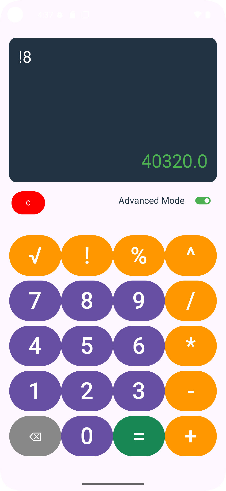

# Kotlin Jetpack Compose Calculator App 🧮

### A beautifully designed calculator app built with Kotlin and Jetpack Compose

This project is a hands-on learning implementation of a **calculator app**, using the **modern Android UI toolkit – Jetpack Compose**. It supports both basic and advanced operations and adapts its layout logic based on device orientation.

 
 

## 📸 Showcase

<table>
  <tr>
    <td><b>Basic Mode</b></td>
    <td><b>Advanced Mode</b></td>
  </tr>

  <tr>
    <td></td>
    <td></td>
  </tr>
</table>

 
 

## ✨ Features

- Basic calculator operations: addition, subtraction, multiplication, division
- Advanced operations: square root (√), factorial (!), modulo (%), exponentiation (^)
- Digit buttons in white, operator buttons in orange, result button in green
- Dynamic layout that adapts to screen size
- Highlighted input panel with colored operators
- State preserved on screen rotation using `rememberSaveable`
- Clean and responsive UI using Jetpack Compose

 

## 📚 What I Learned

The project helped me learn and practice many important **Kotlin** and **Jetpack Compose** concepts.

### 🔸 Kotlin Concepts
- `val` vs `var` – immutability vs mutability
- `object` – singleton pattern, used for utility classes
- `try-catch` – handling invalid expressions gracefully
- `when` – cleaner conditional branching than `if-else`
- `Stack` – used to evaluate Reverse Polish Notation (RPN)
- Loops (`for`, `forEach`) and string interpolation

### 🔹 Jetpack Compose Concepts
- `Activity` and `setContent` – setting the root composable
- `@Composable` functions – UI building blocks
- `Column`, `Row`, `Box`, `Spacer` – building responsive layouts
- `Modifier` – chaining layout behavior (padding, weight, alignment, etc.)
- `Scaffold` – for structured screen layout
- `Button`, `Text` – core UI components
- `MaterialTheme` – applying consistent design
- `remember` vs `rememberSaveable` – state management with configuration change support
- `mutableStateOf` – observable mutable state
- `LocalConfiguration` – to get screen size and orientation
- Custom Composables (CalculatorButton, ModeToggle, etc.)
- Landscape and portrait layout adaptation

 

## 🛠 Stacks

- Kotlin
- Jetpack Compose
- Android SDK

 

## 🧠 Topics Covered

- Mutable and saveable state (`remember`, `rememberSaveable`)
- Responsive layouts (`Modifier.weight`, `aspectRatio`)
- Custom reusable composables
- Calculator logic using the Shunting Yard algorithm
- Handling orientation and screen sizes with `LocalConfiguration`
- Utility objects in Kotlin
- Theming and styling with Material 3

 

## 📝 TODO

- ✅ Add proper landscape layout (UI logic is done, but orientation is currently locked)
- 🔜 Add decimal point (.) support
- 🔜 Add parentheses and complex expression parsing
- 🔜 Add support for scientific functions (e.g., sin, cos, log)

 

## 💡 Q/A

<pre>
Q: Why use rememberSaveable instead of just remember?
A: Because when the device rotates, Compose recreates the composables. 
   `remember` would lose its state, while `rememberSaveable` uses Bundle 
   to persist state across configuration changes.
</pre>

 
 

## 📦 Dependencies

- Jetpack Compose (Material3)
- Kotlin Standard Library
- AndroidX Compose tooling
- No external 3rd party libraries used – all logic is in pure Kotlin

